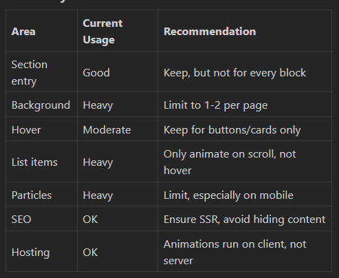

This is a [Next.js](https://nextjs.org) project bootstrapped with [`create-next-app`](https://nextjs.org/docs/app/api-reference/cli/create-next-app).

## Getting Started

First, run the development server:

```bash
npm run dev
# or
yarn dev
# or
pnpm dev
# or
bun dev
```

Open [http://localhost:3000](http://localhost:3000) with your browser to see the result.

You can start editing the page by modifying `app/page.tsx`. The page auto-updates as you edit the file.

This project uses [`next/font`](https://nextjs.org/docs/app/building-your-application/optimizing/fonts) to automatically optimize and load [Geist](https://vercel.com/font), a new font family for Vercel.

## Learn More

To learn more about Next.js, take a look at the following resources:

- [Next.js Documentation](https://nextjs.org/docs) - learn about Next.js features and API.
- [Learn Next.js](https://nextjs.org/learn) - an interactive Next.js tutorial.

You can check out [the Next.js GitHub repository](https://github.com/vercel/next.js) - your feedback and contributions are welcome!

## Deploy on Vercel

The easiest way to deploy your Next.js app is to use the [Vercel Platform](https://vercel.com/new?utm_medium=default-template&filter=next.js&utm_source=create-next-app&utm_campaign=create-next-app-readme) from the creators of Next.js.

Check out our [Next.js deployment documentation](https://nextjs.org/docs/app/building-your-application/deploying) for more details.


WORK TO DO -->
## Discuss animation issues with madam.... --> github copilot report
You have used a lot of animations throughout your codebase, especially with framer-motion for entry, hover, and background effects on almost every section (HomeAbout, HomeApplications, Products, Services, Contact, etc.).

1. Performance & Hosting (EC2)
EC2 itself can handle any React/Next.js app, and the server will not be affected by client-side animations.
However, heavy use of animations (especially many simultaneous or complex ones, e.g. background particles, repeated transitions, hover effects on many elements) can:
Increase CPU/GPU usage on the client (user's device), especially on low-end devices or mobiles.
Cause jank or lag if too many elements animate at once, or if animations are not throttled/optimized.
Increase initial JS bundle size if you import all of framer-motion everywhere.
2. SEO Implications
Animations themselves do not hurt SEO as long as your content is rendered server-side (which Next.js does by default).
But: If you use a lot of client-only rendering (e.g. "use client" everywhere, or hide content until animation is complete), Googlebot may not see your content as quickly.
Heavy use of "whileInView" (content only appears after scroll/animation) can delay content visibility for bots and users, which may slightly impact Core Web Vitals (Largest Contentful Paint, Cumulative Layout Shift).

3. User Experience
Animations can make your site feel modern and engaging.
Too many animations can feel overwhelming, distract from content, or annoy users.
On slow devices, it can make the site feel sluggish.
Honest Recommendations
Keep subtle entry animations for main sections (e.g. fade/slide in for HomeAbout, HomeApplications, hero sections).
Avoid animating every small element (e.g. every list item, every background particle, every hover, every icon).
Limit background/particle animations to one or two per page.
Optimize framer-motion usage: Use variants and batch animations, avoid unnecessary re-renders.
Test on mobile and low-end devices to ensure smoothness.
For SEO: Make sure all important content is visible in the DOM on initial render (even if it's faded in).

Summary Table


Bottom Line
You have not "overused" animations to the point of breaking your site, but you are close to the upper limit for a professional, performant site.
Trim down background/particle and per-item animations.
Keep main section transitions and button hovers.
Test on mobile and slow devices before launch.
If you want a specific audit of a page, let me know!

## try using parallel routes for images imported from google drive

## discuss form issues with mam --> avoid unnecessary custom forms

## ask if specific dedicated pages for products and services are needed, if yes then ask for more images and information